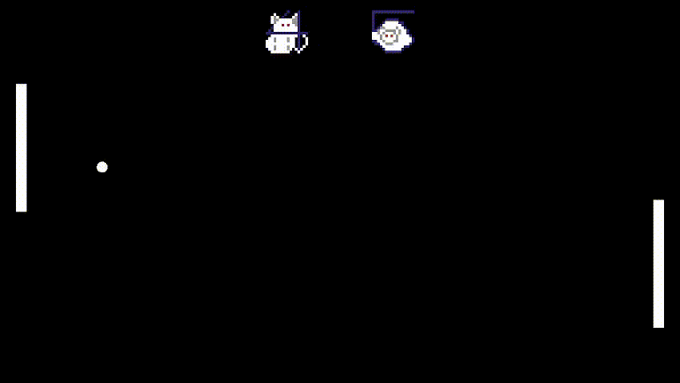

# Go-Pong
A Pong video game clone made with Go lang and OpenGL 3.3 using C.
## Gameplay



Check [Dependencies](#dependencies)
### Offline
Key bindings are 'w' and 's' for the left player and 'up arrow' and 'down arrow' for the right player, score is kept in terminal (for now...)
### Multiplayer
go-pong supports multiplayer by hosting a game and joining it, hosting can be performed by running ```./go-pong -h <port> ``` , and connecting to that host can be performed by running ```./go-pong <ip:address:port> ``` , control your player with up and down arrows.
## Deployment
if you faced a problem when deploying go-pong server, remove ```import "C"``` and all the generated error from that action, build it, and run it on servers only (since offline and clients mode won't work without the C renderer)
## Building
After installing the required dependencies, run ```go build```, make sure your executable is in the same folder than contains the *Shader* and *Textures* folders.
### Dependencies:
- [cglm](https://github.com/recp/cglm) (Runtime required)
- [glew](http://glew.sourceforge.net/) (Runtime required)
- [glfw](https://glfw.org/) (Runtime required)
- [stb_image](https://github.com/nothings/stb)
## Contributions
Are welcome !
## License
Under MIT, check [License](LICENSE)

### Created with fuzzy kittens, with the help of RedDeadAlice